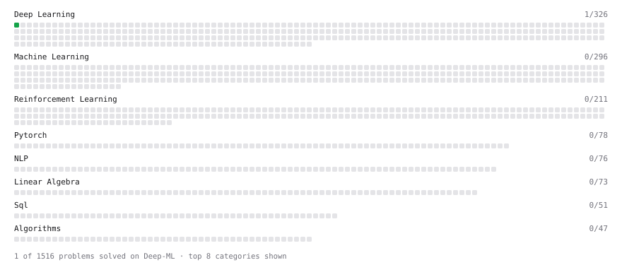

# Deep-ML

My machine learning practice from [Deep-ML](https://www.deep-ml.com). Every solution here was written by hand.

**5** solved · 5 problems · 0 labs · 0 math

[**Browse the interactive portfolio**](https://Soni-KR.github.io/deep-ml/) to replay this filling in over time.

## Problems

| | Difficulty | Solved | |
| --- | --- | --- | --- |
| [Linear Regression Using Normal Equation](https://www.deep-ml.com/problems/14) | easy | 2026-10-03 | [solution](problems/0014-linear-regression-using-normal-equation) |
| [Sigmoid Activation Function Understanding](https://www.deep-ml.com/problems/22) | easy | 2026-10-03 | [solution](problems/0022-sigmoid-activation-function-understanding) |
| [Single Neuron](https://www.deep-ml.com/problems/24) | easy | 2026-10-03 | [solution](problems/0024-single-neuron) |
| [Softmax Activation Function Implementation ](https://www.deep-ml.com/problems/23) | easy | 2026-10-03 | [solution](problems/0023-softmax-activation-function-implementation) |
| [Single Neuron with Backpropagation](https://www.deep-ml.com/problems/25) | medium | 2026-10-03 | [solution](problems/0025-single-neuron-with-backpropagation) |

---

_This file is regenerated by Deep-ML on every push._
